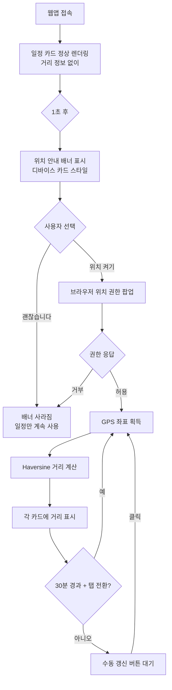
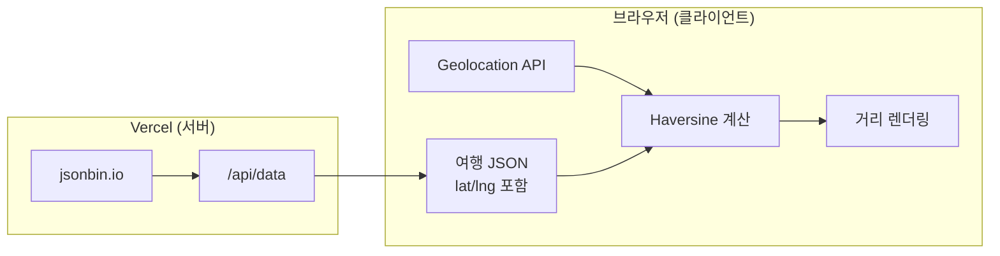
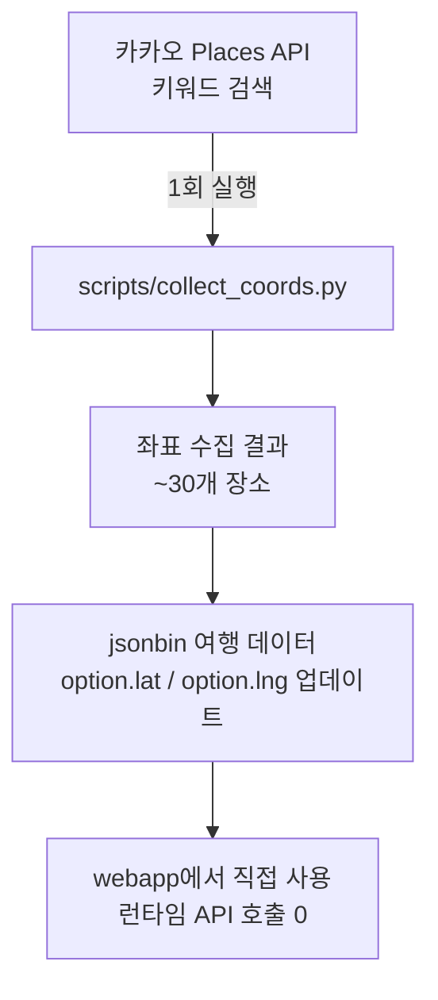

# T-003 거리 표시 기능 기획서

> **Status**: 오너 검토 대기
> **작성**: 를르슈(TL) — 크라피카(UX), 유키(Research) 보고 종합
> **감사**: 체펠리(Auditor) 규칙 감사 완료
> **관련 티켓**: [T-003](../tickets/T-003.md) | **스토리**: [S-001](../stories/S-001.md)

---

## 1. 요약

웹앱 일정표에서 **사용자의 현재 위치 기준으로 각 장소까지의 대략적 거리를 표시**한다.
브라우저 Geolocation API + Haversine 직선거리 계산으로 구현하며,
좌표는 여행 JSON에 사전 저장한다. 서버에 위치 데이터를 전송하지 않는다.

---

## 2. 사용자 플로우



---

## 3. UI 상태 정의

### 3-1. 위치 안내 배너

일정 로드 완료 1초 후 표시. 디바이스 카드 스타일로 디자인 시스템과 일관성 유지.

```
┌─────────────────────────────────────────┐
│  DEVICE CARD (housing: white)           │
│  ┌───────────────────────────────────┐  │
│  │  DISPLAY SCREEN (bg: #2A2A2A)    │  │
│  │                                   │  │
│  │  위치를 켜면 각 장소까지          │  │
│  │  거리를 확인할 수 있습니다        │  │
│  │                                   │  │
│  └───────────────────────────────────┘  │
│                                         │
│  [ 위치 켜기 ]       [ 괜찮습니다 ]     │
│  (검정/흰글씨)       (흰/어두운글씨)    │
└─────────────────────────────────────────┘
```

- **[위치 켜기]** 클릭 → 브라우저 위치 권한 요청
- **[괜찮습니다]** 클릭 → 배너 사라짐, localStorage에 거부 기록 (다음 접속 시 배너 미표시)
- 배너 미표시 조건: HTTPS 아닌 경우, navigator.geolocation 미지원

### 3-2. 거리 행 — 아이템 카드 내

제목 바로 아래에 `.item-distance` 행 배치:

```
┌──────────────────────────────────────┐
│ [●] [09:00~]                  [식사] │
│ 황남해장국                            │
│ 현재 위치에서 약 2.3km · 차량 5분     │  ← 거리 행
│ ─────────────────────────────────── │
│  황남해장국 본점              2.3km  │  ← 옵션별 거리
│  교리김밥 경주점              1.8km  │
└──────────────────────────────────────┘
```

### 3-3. 거리 표현 규칙

| 거리 | 표현 | 색상 | 의미 |
|------|------|------|------|
| **1km 미만** | `도보 약 N분 (0.Xkm)` | `var(--accent)` 주황 | 걸어갈 수 있는 거리 |
| **1~5km** | `약 N.Nkm · 차량 약 N분` | `var(--item-text-dim)` 회색 | 일반 이동 거리 |
| **5km 이상** | `약 Nkm · 차량 약 N분` | `var(--item-text-dim)` 회색 | 일반 이동 거리 |
| **50km 이상** | `현재 경주 근처가 아닙니다` | `var(--text-light)` | 경주 밖 |

- 도보 시간: 거리(m) / 67 (시니어 보행 속도 분속 67m 반영)
- 차량 시간: 거리(km) / 30 (경주 시내 평균)
- "약"을 항상 표기 → 대략적 수치임을 명시

### 3-4. 옵션별 거리

- 옵션 2개 이상인 항목 → 각 옵션 이름 오른쪽에 소형 거리 표시
- **확정(chosen) 옵션**의 거리가 카드 상단 `.item-distance`에 대표 표시
- 미확정 시 → 가장 가까운 옵션의 거리를 대표 표시

### 3-5. 갱신 UI

- 헤더 영역에 작은 갱신 버튼 (위치 활성화 시에만 표시)
- 갱신 시 "위치 업데이트됨" 토스트

---

## 4. 기술 설계

### 4-1. 아키텍처



**완전 클라이언트 사이드** — 사용자 위치를 서버에 전송하지 않는다.

### 4-2. 좌표 데이터 전략: JSON 사전 저장



| 방식 | API 호출 | 정확도 | 복잡도 |
|------|----------|--------|--------|
| ~~런타임 카카오 검색~~ | 매 접속 시 ~30회 | 검색어 불일치 리스크 | 높음 |
| **JSON 사전 저장 (채택)** | **0** | **확정적** | **낮음** |

### 4-3. Geolocation API 사용

```javascript
// 설정값
{
  enableHighAccuracy: false,  // Wi-Fi/셀룰러 기반 (배터리 절약)
  timeout: 10000,             // 10초 대기
  maximumAge: 300000          // 5분 캐시 허용
}
```

### 4-4. 데이터 구조 변경

현재 option 스키마에 `lat`, `lng` 필드 추가:

```json
{
  "name": "황남해장국",
  "menu": "해장국 10,000원",
  "dad": "good",
  "hiro": "good",
  "lat": 35.8370,
  "lng": 129.2130
}
```

`src/tool_definitions.py`의 `update_option` 도구에 `lat`/`lng` 파라미터 추가.

---

## 5. 엣지 케이스

| 상황 | 처리 |
|------|------|
| 위치 권한 거부 | 거리 비표시, 일정 정상 동작 |
| [괜찮습니다] 선택 | localStorage에 기록, 다음 접속 시 배너 미표시 |
| GPS 정확도 500m 이상 | "위치가 정확하지 않을 수 있습니다" 토스트 1회 |
| 좌표 없는 장소 | 해당 카드 거리 행 생략 |
| 경주 밖 (50km+) | "현재 경주 근처가 아닙니다" 표시, 개별 거리 숨김 |
| HTTPS 아닌 환경 | 배너 자체를 미표시 |
| 브라우저 미지원 | navigator.geolocation 없으면 배너 미표시 |
| 위치 타임아웃 | 10초 초과 시 "위치를 가져올 수 없습니다" 토스트 |

---

## 6. 변경 파일 목록

| 파일 | 변경 내용 | 유형 |
|------|-----------|------|
| `webapp/index.html` | 위치 배너, 거리 행, Geolocation, Haversine | 수정 |
| `src/tool_definitions.py` | option 스키마에 lat/lng 추가 | 수정 |
| `scripts/collect_coords.py` | 카카오 Places로 좌표 일괄 수집 스크립트 | **신규** |
| `webapp/index.html` | 카카오 SDK `<script>` 태그 제거 | 수정 |

---

## 7. 선행 작업 (구현 전 필요)

1. **T-001 PR merge** — 오너 승인 필요
2. **좌표 수집 스크립트 실행** — collect_coords.py로 ~30개 장소 좌표 수집
3. **jsonbin 데이터 업데이트** — 수집된 좌표를 여행 JSON에 반영

---

## 8. 미결 사항 (오너 결정 필요)

| # | 사항 | 선택지 | 팀 권장 |
|---|------|--------|---------|
| 1 | 카카오 SDK 제거 여부 | A: 제거 (좌표 사전 저장으로 불필요) / B: 유지 (향후 확장 대비) | **A: 제거** |
| 2 | 도보/차량 시간 표시 | A: km만 표시 / B: km + 예상 시간 병기 | **B: 병기** |
| 3 | 배너 재표시 | A: [괜찮습니다] 후 영구 숨김 / B: 7일 후 다시 표시 | **A: 영구 숨김** |

---

## 9. 검증 방법

1. Vercel 로컬에서 일정 로드 → 위치 배너 표시 확인
2. [위치 켜기] → 브라우저 권한 허용 → 각 카드에 거리 표시 확인
3. [괜찮습니다] → 배너 사라짐, 일정 정상 동작 확인
4. 탭 전환 시 거리 재계산 확인
5. 경주 밖에서 접속 시 "경주 근처가 아닙니다" 표시 확인

---

*이 문서는 오너 승인 후 T-003 티켓의 구현 기준이 된다.*
